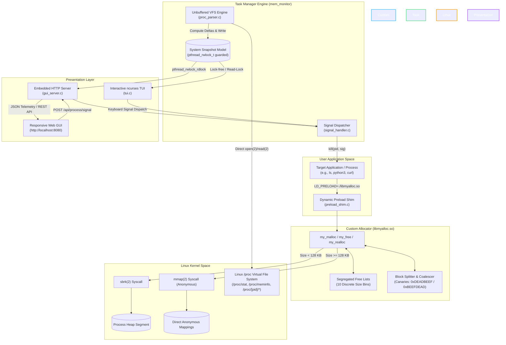
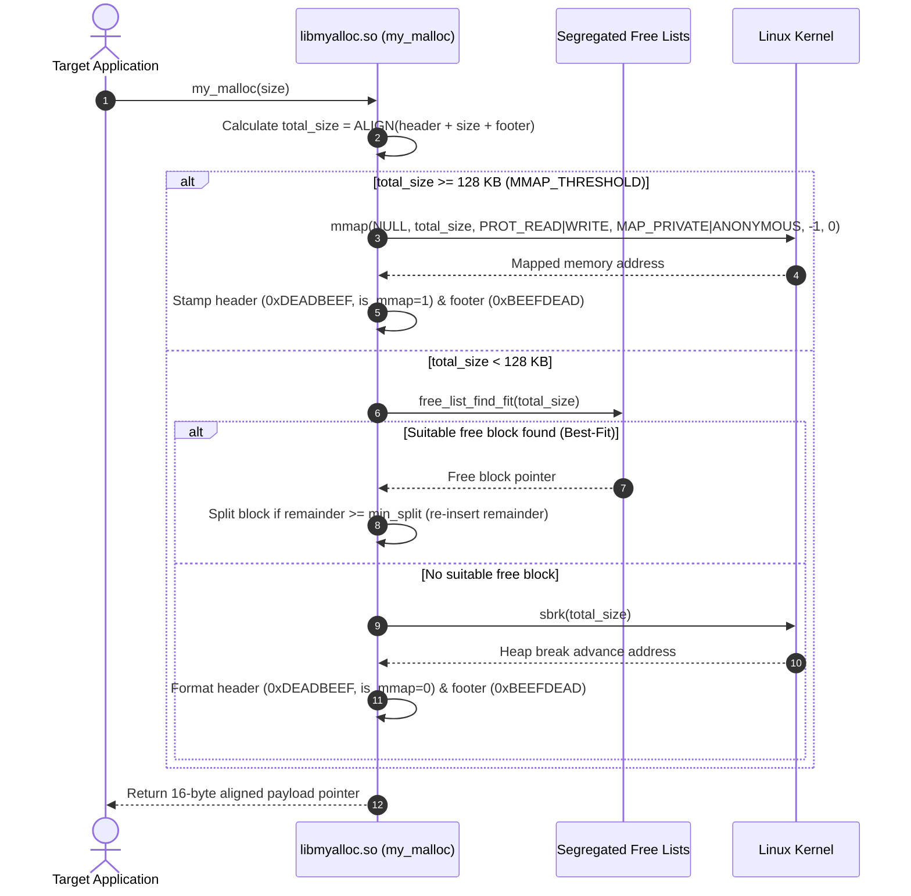

# Linux Dynamic Memory Allocation & System Task Manager

<div align="center">

[](https://github.com/tejaswin-amara/Linux-Dynamic-Memory-Allocation-and-Memory-Monitoring-System/actions/workflows/ci.yml)
[](https://en.wikipedia.org/wiki/C11_(C_standard_revision))
[](https://kernel.org)
[](#6-verification-benchmarking--stress-testing)
[](#6-verification-benchmarking--stress-testing)
[](https://github.com/ThrowTheSwitch/Unity)
[](LICENSE)
[](#1-curriculum-traceability-matrix-25cs2104e)

**A production-grade, dual-pillar Linux systems engineering software suite combining a custom segregated-fit dynamic memory allocator with a non-invasive, zero-allocation Linux kernel VFS process monitoring daemon.**

[Key Features](#key-features) • [Visual Previews](#visual-previews) • [Curriculum Matrix](#1-curriculum-traceability-matrix-25cs2104e) • [Architecture](#2-system-architecture) • [Core Modules](#3-core-modules-deep-dive) • [Quickstart](#4-quickstart--execution-guide) • [Benchmarks](#6-verification-benchmarking--stress-testing) • [ADRs & Docs](#8-documentation--architecture-decision-records)

</div>

---

## Overview

Developed as a Systems Software Capstone for **KLEF 25CS2104E: Outside-In Operating Systems & Systems Programming**, this repository unifies two fundamental operating systems engineering challenges into a single cohesive, high-performance C suite:

1. **Custom Dynamic Memory Allocator (`libmyalloc.so`)**: A drop-in POSIX `malloc`/`free`/`calloc`/`realloc` replacement library. Employs 10-bin segregated free lists, best-fit bin search, 16-byte payload alignment, boundary-tag canaries (`0xDEADBEEF` / `0xBEEFDEAD`) for buffer overrun / double-free detection, $O(1)$ bidirectional block coalescing, and a hybrid threshold strategy switching between `sbrk(2)` (< 128 KB) and anonymous `mmap(2)` (≥ 128 KB). Intercepts external Linux binaries via `LD_PRELOAD`.
2. **Virtual File System Process Monitor (`mem_monitor`)**: A high-efficiency system monitoring engine that directly samples kernel statistics from `/proc` using raw, unbuffered POSIX system calls (`open`, `read`, `close`) without invoking any dynamic heap allocations in its sampling loop. Features a dual-interface presentation layer:
   - **Interactive Terminal UI (TUI)**: Built with `ncurses`, providing non-blocking keyboard controls, CPU/memory percentage bars, dynamic sorting, and real-time POSIX signal dispatching.
   - **Embedded Real-Time Web GUI**: Powered by a multi-threaded embedded POSIX socket HTTP daemon (`gui_server.c`) streaming telemetry via a REST API (`/api/metrics`) to a responsive HTML5/CSS3 dark-mode dashboard.

---

## Key Features

- **Segregated Free Lists (10 Size Classes)**: Drastically reduces external fragmentation and lookup latency compared to standard linked-list allocators.
- **Canary-Guarded Boundary Tags**: 32-byte header canary (`0xDEADBEEF`) and 16-byte footer canary (`0xBEEFDEAD`) provide instant crash diagnostics on heap corruption.
- **Zero-Allocation Sampling Engine**: Telemetry reads consume zero heap allocations in steady state; reads are dispatched into pre-allocated stack buffers to guarantee non-invasive profiling.
- **Microsecond Differential CPU Calculation**: Accurately computes true multi-core differential CPU utilization against system jiffies delta.
- **Dual Interface Concurrency**: The ncurses TUI and embedded HTTP server concurrently access telemetry snapshots guarded by a thread-safe read-write lock (`pthread_rwlock_t`).
- **Interactive Signal Control**: Send POSIX signals (`SIGSTOP`, `SIGCONT`, `SIGTERM`, `SIGKILL`) directly from the terminal keyboard or the Web GUI buttons.
- **Memory Safety Hardened**: Tested with AddressSanitizer (ASan), UndefinedBehaviorSanitizer (UBSan), Valgrind Memcheck (zero leaks), and Unity unit tests.

---

## Visual Previews

### 1. Interactive Terminal UI (TUI) Preview
The `ncurses` dashboard renders global CPU utilization per core, physical RAM and Swap gauges, sortable process lists, and a live action bar:

```
┌── Linux Dynamic Memory Allocation & System Task Manager (KLEF 25CS2104E) ──────────────────────┐
│                                                                                                │
│ CPU [ 18.4%] [||||||||                      ] Cores: 8                                         │
│ MEM [ 42.1%] [||||||||||||||                ] Used: 3368 MB / 8000 MB                          │
│ SWAP[  4.2%] [||                            ] Used:  168 MB / 4000 MB                          │
│                                                                                                │
│   PID  PPID COMMAND            S THREADS     CPU%    RSS(KB)    PSS(KB)  CTX-VOL  CTX-NVOL     │
│  1420  1102 python3            R      12    12.4%     184200     142000     2841       102     │
│  2041     1 mem_monitor        S       3     2.1%      14280      10120      912        14     │
│   912     1 systemd-journald   S       1     0.8%      42100      38400     4120        29     │
│   450     1 rsyslogd           S       4     0.2%       8200       6100      480         2     │
│  3120  1420 ls                 S       1     0.0%       1920       1400       12         0     │
│                                                                                                │
├────────────────────────────────────────────────────────────────────────────────────────────────┤
│ [Sort: CPU] | [j/k/Arrows] Navigate | [p] CPU% | [m] Mem | [K] Kill | [s] Stop | [c] Cont | [q]│
│ Status: Process 1420 selected (python3)                                                        │
└────────────────────────────────────────────────────────────────────────────────────────────────┘
```

### 2. Embedded Real-Time Web GUI (`http://localhost:8080`)
A responsive dark-mode web console served directly by `mem_monitor`'s embedded C HTTP daemon:

```
┌────────────────────────────────────────────────────────────────────────────────────────────────┐
│  ● LIVE   Linux System Task Manager                  [25CS2104E Capstone]   [Refresh Now]      │
├───────────────────────────────┬───────────────────────────────┬────────────────────────────────┤
│ CPU Utilization               │ Memory (RAM)                  │ Swap Space                     │
│ 18.4%                         │ 42.1%                         │ 4.2%                           │
│ [████████░░░░░░░░░░░░░░░░░░░] │ [██████████████░░░░░░░░░░░░░] │ [██░░░░░░░░░░░░░░░░░░░░░░░░]   │
│ Cores: 8 | User: 12% | Sys: 6%│ Used: 3368 MB / 8000 MB       │ Used: 168 MB / 4000 MB         │
├───────────────────────────────┴───────────────────────────────┴────────────────────────────────┤
│ Active Processes (184)                     [ Search PID / Command... ] [ Sort by: CPU %    ▼ ] │
├───────┬──────────────────────┬───────┬─────────┬──────────┬──────────┬─────────────────────────┤
│ PID   │ Command              │ State │ Threads │ CPU %    │ RSS (KB) │ Signal Actions          │
├───────┼──────────────────────┼───────┼─────────┼──────────┼──────────┼─────────────────────────┤
│ 1420  │ python3              │ R     │ 12      │ 12.4%    │ 184200   │ [STOP] [CONT] [KILL]    │
│ 2041  │ mem_monitor          │ S     │ 3       │ 2.1%     │ 14280    │ [STOP] [CONT] [KILL]    │
│ 912   │ systemd-journald     │ S     │ 1       │ 0.8%     │ 42100    │ [STOP] [CONT] [KILL]    │
└───────┴──────────────────────┴───────┴─────────┴──────────┴──────────┴─────────────────────────┘
```

### 3. REST API Telemetry Output (`GET /api/metrics`)
```json
{
  "cpu": {
    "total_usage_pct": 18.40,
    "user_pct": 12.10,
    "system_pct": 6.30,
    "core_count": 8
  },
  "mem": {
    "mem_total_kb": 8192000,
    "mem_available_kb": 4743200,
    "mem_usage_pct": 42.10,
    "swap_total_kb": 4096000,
    "swap_free_kb": 3923968,
    "swap_usage_pct": 4.20
  },
  "processes": [
    {
      "pid": 1420,
      "ppid": 1102,
      "comm": "python3",
      "state": "R",
      "num_threads": 12,
      "cpu_usage_pct": 12.40,
      "vm_rss_kb": 184200
    }
  ]
}
```

---

## 1. Curriculum Traceability Matrix (25CS2104E)

This project strictly adheres to the course outcome requirements for **KLEF 25CS2104E: Outside-In Operating Systems & Systems Programming**:

| Course Outcome | Focus Area | Concrete Implementation in Codebase | Source Reference |
|---|---|---|---|
| **CO1: OS Service Layer** | Direct syscall tracing, `errno` error boundaries, and kernel-space interaction | Direct invocations of `sbrk(2)`, `mmap(2)`, `munmap(2)`, `open(2)`, `read(2)`, `close(2)`, `kill(2)`, and `sysconf(3)`. Strict validation of return codes and errno propagation. Verified with `strace`. | [`src/allocator/allocator.c`](src/allocator/allocator.c)<br>[`src/monitor/proc_parser.c`](src/monitor/proc_parser.c) |
| **CO2: Process Control** | Process lifecycle, task states, differential scheduling calculations | Scanning `/proc` directories, parsing process states (`R`, `S`, `D`, `Z`, `T`), calculating differential CPU usage against jiffies delta, and managing background sampling threads. | [`src/monitor/proc_parser.c`](src/monitor/proc_parser.c)<br>[`include/proc_parser.h`](include/proc_parser.h) |
| **CO3: Inter-Process Communication** | Signal dispatching, handling, and network streaming | Real-time transmission of POSIX signals (`SIGINT`, `SIGTERM`, `SIGKILL`, `SIGSTOP`, `SIGCONT`) using `kill(2)`. Inter-thread synchronization and IPC streaming via POSIX TCP sockets. | [`src/monitor/signal_handler.c`](src/monitor/signal_handler.c)<br>[`src/monitor/gui_server.c`](src/monitor/gui_server.c) |
| **CO4: Memory Management** | Custom dynamic memory allocator & virtual memory parsing | Segregated free lists (10 size bins), best-fit search, boundary tags with canary words (`0xDEADBEEF`/`0xBEEFDEAD`), hybrid `sbrk()` (< 128 KB) vs `mmap()` (≥ 128 KB), and `/proc/[pid]/maps` parsing. | [`src/allocator/allocator.c`](src/allocator/allocator.c)<br>[`src/allocator/free_list.c`](src/allocator/free_list.c) |
| **CO5: File Systems** | Direct VFS parsing via low-level unbuffered POSIX file I/O | Unbuffered `open()`, `read()`, and `close()` parsing of `/proc/stat`, `/proc/meminfo`, `/proc/[pid]/stat`, `/proc/[pid]/status`, and `/proc/[pid]/smaps_rollup` using fixed stack buffers. | [`src/monitor/proc_parser.c`](src/monitor/proc_parser.c)<br>[`docs/architecture/adr/ADR-002-proc-parsing-strategy.md`](docs/architecture/adr/ADR-002-proc-parsing-strategy.md) |
| **CO6: Concurrency** | POSIX multithreading and race condition mitigation | Thread-safe heap allocation guarded by `pthread_mutex_t`; concurrent telemetry updates and HTTP client reads synchronized via read-write locks (`pthread_rwlock_t`). | [`src/allocator/allocator.c`](src/allocator/allocator.c)<br>[`src/monitor/gui_server.c`](src/monitor/gui_server.c) |

---

## 2. System Architecture

The following diagram illustrates how external user applications, the custom dynamic memory allocator, the Linux kernel, the task manager daemon, and the dual interfaces interact:



### Memory Allocation Lifecycle



---

## 3. Core Modules Deep-Dive

### 3.1 Custom Dynamic Memory Allocator (`libmyalloc.so`)

The allocator provides an efficient, thread-safe memory management system designed to eliminate external fragmentation while offering active integrity defenses against undefined memory behavior.

#### Memory Block Layout & Alignment
Every memory block returned by `my_malloc()` is padded to guarantee **16-byte boundary alignment**:

```
+-------------------------------------------------------------------------------------------------+
|                                       MEMORY CHUNK LAYOUT                                       |
+------------------------------------------------+----------------------------+-------------------+
|                  BLOCK HEADER                  |        USER PAYLOAD        |   BLOCK FOOTER    |
|                   (32 Bytes)                   |     (16-Byte Aligned)      |    (16 Bytes)     |
+------------------------------------------------+----------------------------+-------------------+
|  magic_header   : 0xDEADBEEF (4B Canary)       |  Usable memory space       |  magic_footer     |
|  is_free        : 0 or 1 (4B Flag)             |  requested by caller       |  : 0xBEEFDEAD     |
|  requested_size : User-requested bytes (8B)    |  ...                       |    (4B Canary)    |
|  block_size     : Total chunk size (8B)        |  ...                       |  padding (4B)     |
|  is_mmap        : sbrk (0) vs mmap (1) (4B)    |  ...                       |  block_size (8B)  |
|  padding        : 16-byte alignment pad (4B)   |  ...                       |                   |
|  *next, *prev   : Free list pointers (16B)     |                            |                   |
+------------------------------------------------+----------------------------+-------------------+
```

#### Segregated Free Lists (10 Size Bins)
Free chunks allocated via `sbrk()` are organized into 10 doubly-linked bins based on total block size:

| Bin Index | Maximum Block Size | Target Allocation Class | Search Strategy |
|:---:|:---|:---|:---|
| **0** | $\le 32\text{ Bytes}$ | Tiny primitives, pointers, micro-strings | Exact / Best-Fit |
| **1** | $\le 64\text{ Bytes}$ | Small structures, short strings | Best-Fit |
| **2** | $\le 128\text{ Bytes}$ | Medium nodes, small buffers | Best-Fit |
| **3** | $\le 256\text{ Bytes}$ | Path buffers, small structs | Best-Fit |
| **4** | $\le 512\text{ Bytes}$ | Standard I/O chunks | Best-Fit |
| **5** | $\le 1024\text{ Bytes (1 KB)}$ | Page fragments, small tables | Best-Fit |
| **6** | $\le 2048\text{ Bytes (2 KB)}$ | Half-page buffers | Best-Fit |
| **7** | $\le 4096\text{ Bytes (4 KB)}$ | Standard Linux OS pages | Best-Fit |
| **8** | $\le 8192\text{ Bytes (8 KB)}$ | Multi-page scratch buffers | Best-Fit |
| **9** | $> 8192\text{ Bytes} \dots < 128\text{ KB}$ | Large heap buffers below `MMAP_THRESHOLD` | Best-Fit with Escalation |

#### Bidirectional $O(1)$ Coalescing
When `my_free()` is invoked:
1. **Canary Validation**: Both `header->magic_header == 0xDEADBEEF` and `footer->magic_footer == 0xBEEFDEAD` are verified. A mismatch triggers an immediate error abort, catching off-by-one overflows and double-free corruption.
2. **Forward Coalescing**: Checks `(char *)header + header->block_size`. If the adjacent block is free and not mapped via `mmap`, it is unlinked from its segregated bin and merged in $O(1)$.
3. **Backward Coalescing**: Inspects the boundary footer located immediately before the current header (`(char *)header - sizeof(block_footer_t)`). If its canary is valid and the preceding block is marked free, both blocks are combined into a single contiguous chunk.

#### Dynamic Preload Interception (`preload_shim.c`)
The allocator provides dynamic symbol interception via standard Linux dynamic linking (`dlsym(RTLD_NEXT, ...)`), allowing existing binaries to use `libmyalloc.so` without recompilation:
```bash
LD_PRELOAD=./libmyalloc.so /bin/ls -la
```

---

### 3.2 Process & VFS Telemetry Engine (`proc_parser`)

#### Zero-Allocation Telemetry Architecture
Traditional utilities rely on buffered glibc calls (`fopen`/`fgets`), triggering internal heap allocations and caching delays that perturb profiling accuracy. `mem_monitor` executes its telemetry gathering loop with **zero heap allocations**:
- Employs low-level POSIX syscalls: `open(2)`, `read(2)`, and `close(2)` with `O_RDONLY`.
- Direct parsing into pre-allocated 4096-byte stack buffers.
- Pre-allocated snapshot records up to 2048 simultaneous processes (`MAX_PROCS`).

#### Virtual File System Nodes
| Kernel VFS Path | Extracted Parameters | Operational Metric |
|---|---|---|
| `/proc/stat` | `user`, `nice`, `system`, `idle`, `iowait`, `irq`, `softirq`, `steal` | Global CPU jiffies & overall utilization |
| `/proc/meminfo` | `MemTotal`, `MemFree`, `MemAvailable`, `Buffers`, `Cached`, `SwapTotal`, `SwapFree` | Physical RAM and Swap capacity and saturation |
| `/proc/[pid]/stat` | `comm`, `state`, `ppid`, `utime`, `stime`, `priority`, `nice`, `num_threads` | Process state, parentage, and thread count |
| `/proc/[pid]/status` | `VmSize`, `VmRSS`, `voluntary_ctxt_switches`, `nonvoluntary_ctxt_switches` | Resident memory and scheduler context switches |
| `/proc/[pid]/smaps_rollup` | `Pss`, `Rss`, `Shared_Clean`, `Shared_Dirty` | Proportional Set Size (PSS) memory accounting |
| `/proc/[pid]/maps` | Virtual address intervals, permissions (`rwxp`), offset, device, inode | Virtual memory map address ranges |

#### Differential CPU Calculation
Instantaneous CPU usage is derived across successive sampling intervals ($\Delta t$):

$$\Delta \text{proc\_time} = (\text{utime}_2 + \text{stime}_2) - (\text{utime}_1 + \text{stime}_1)$$

$$\Delta \text{system\_jiffies} = \text{total\_jiffies}_2 - \text{total\_jiffies}_1$$

$$\text{CPU \%} = \left( \frac{\Delta \text{proc\_time}}{\Delta \text{system\_jiffies}} \right) \times 100 \times N_{\text{cores}}$$

---

### 3.3 Dual Interface Layer

#### Interactive Terminal User Interface (TUI)
- **Engine**: Implemented with POSIX `ncurses` using non-blocking input (`nodelay(stdscr, TRUE)`).
- **Navigation**: Supports both arrow keys and standard **Vim bindings** (`j` for down, `k` for up).
- **Color Thresholds**: Dynamic visual alerts (Cyan for chrome, Green for $<50\%$, Yellow for $50-80\%$, Red for $>80\%$, and inverted highlighting for selection).

#### Embedded C HTTP Server (`gui_server.c`)
- **Zero Dependencies**: Pure POSIX socket implementation in C; no external web server or Node.js/Python runtime required.
- **Multithreading**: Listens on a dedicated background thread (`pthread_create`).
- **Synchronization**: Thread-safe snapshot exchanges between the monitoring loop and incoming HTTP clients use POSIX read-write locks (`pthread_rwlock_t`).

#### REST API Specification
| Endpoint | Method | Request Payload | Response / Status | Description |
|---|:---:|---|---|---|
| `/` or `/index.html` | `GET` | None | `200 OK` (`text/html`) | Serves the main Web GUI dashboard |
| `/style.css` | `GET` | None | `200 OK` (`text/css`) | Serves dark-mode styles |
| `/app.js` | `GET` | None | `200 OK` (`application/javascript`) | Serves telemetry polling & client UI scripts |
| `/api/metrics` | `GET` | None | `200 OK` (`application/json`) | Returns system CPU, RAM, Swap, and top process metrics |
| `/api/process/signal`| `POST` | `{"pid": 1234, "signal": "SIGTERM"}` | `200 OK` (`{"status":"DISPATCHED"}`) | Dispatches a POSIX signal to target PID via `kill(2)` |

---

## 4. Quickstart & Execution Guide

### Prerequisites
Ubuntu 24.04 LTS (or compatible Linux distribution) with standard development packages:
```bash
sudo apt-get update
sudo apt-get install -y build-essential gcc make valgrind libncurses-dev clang-format curl
```

### Automated 1-Command Setup (`run_ubuntu.sh`)
The repository includes an automated orchestration runner that installs prerequisites, cleans, builds, and launches the task manager:

```bash
# Launch interactive TUI + Web GUI on port 8080
./scripts/run_ubuntu.sh

# Launch in headless daemon mode with Web GUI on port 9090
./scripts/run_ubuntu.sh --headless --port 9090

# Print a single JSON system telemetry snapshot and exit
./scripts/run_ubuntu.sh --json

# Build and execute the comprehensive test suite
./scripts/run_ubuntu.sh --test

# Setup dependencies and build binaries only (no launch)
./scripts/run_ubuntu.sh --setup-only
```

### Manual Compilation
```bash
# Build libmyalloc.so and mem_monitor
make all

# Build with AddressSanitizer and UndefinedBehaviorSanitizer
make asan

# Clean build artifacts
make clean
```

---

## 5. Usage Guide

### Running the System Task Manager
```bash
# 1. Interactive mode (ncurses TUI + Web GUI at http://localhost:8080)
./mem_monitor

# 2. Custom Web GUI port
./mem_monitor --port 9090

# 3. Headless server mode (no TUI, Web GUI active)
./mem_monitor --headless --port 8080

# 4. Single-shot JSON output (ideal for automation or piping into jq)
./mem_monitor --json | jq .
```

### TUI Keyboard Controls Reference
| Keybinding | Action | Description |
|:---:|---|---|
| <kbd>↓</kbd> or <kbd>j</kbd> | Navigate Down | Move selection cursor down the process table |
| <kbd>↑</kbd> or <kbd>k</kbd> | Navigate Up | Move selection cursor up the process table |
| <kbd>p</kbd> / <kbd>P</kbd> | Sort by CPU | Toggle process list sorting by differential CPU % descending |
| <kbd>m</kbd> / <kbd>M</kbd> | Sort by Memory | Toggle process list sorting by Resident Set Size (RSS) descending |
| <kbd>s</kbd> / <kbd>S</kbd> | Send `SIGSTOP` | Freeze / pause execution of the highlighted process |
| <kbd>c</kbd> / <kbd>C</kbd> | Send `SIGCONT` | Resume execution of a paused process |
| <kbd>K</kbd> *(Shift+K)* | Send `SIGKILL` | Immediately terminate the highlighted process |
| <kbd>q</kbd> / <kbd>Q</kbd> | Quit Monitor | Restore terminal modes cleanly and terminate daemon |

### Intercepting External Binaries with `libmyalloc.so`
You can hook the custom allocator into arbitrary Linux binaries using `LD_PRELOAD`:

```bash
# Trace coreutils execution under libmyalloc.so
LD_PRELOAD=./libmyalloc.so ls -la /tmp

# Intercept memory allocations inside a Python script
LD_PRELOAD=./libmyalloc.so python3 -c "data = [x**2 for x in range(1000000)]; print('Done:', len(data))"

# Intercept memory allocations in curl
LD_PRELOAD=./libmyalloc.so curl -s https://example.com > /dev/null
```

---

## 6. Verification, Benchmarking & Stress Testing

The codebase enforces strict verification protocols covering unit correctness, memory safety, concurrency, and performance comparisons against `glibc`.

```
+-------------------------------------------------------------------------+
|                        VERIFICATION PIPELINE                            |
+-------------------+-------------------+----------------+----------------+
|  Unit Tests       |  Sanitizers       |  Valgrind      |  Benchmarks    |
|  Unity Framework  |  ASan & UBSan     |  Memcheck      |  vs glibc      |
|  (make test)      |  (make asan)      |  (make valgrind|  (make bench)  |
+-------------------+-------------------+----------------+----------------+
```

### 1. Unit & Integration Tests
Runs test suites written with the [Unity C framework](https://github.com/ThrowTheSwitch/Unity):
```bash
make test
```
- `test_allocator`: Validates `my_malloc`, `my_calloc`, `my_realloc`, `my_free`, boundary canaries, block splitting, and segregated free list reuse.
- `test_proc_parser`: Validates `/proc/stat`, `/proc/meminfo`, and process snapshot parsing correctness.
- `test_signal_handler`: Verifies POSIX signal name translation and dispatch logic.
- `tests/integration_test.sh`: End-to-end test validating `LD_PRELOAD` binary execution and headless JSON telemetry streaming.

### 2. AddressSanitizer & UndefinedBehaviorSanitizer
Compiles with `-fsanitize=address,undefined -fno-omit-frame-pointer`:
```bash
make asan
./test_allocator
./test_proc_parser
./test_signal_handler
```

### 3. Valgrind Memory Leak Checks
Verifies zero memory leaks and clean heap destruction:
```bash
make valgrind
```

### 4. Allocator Performance Benchmark (`scripts/benchmark.sh`)
Compares `libmyalloc.so` against GNU C Library (`glibc`) `malloc` across 500,000 randomized operations and measures fragmentation resilience:
```bash
make benchmark
```
*Expected benchmark output:*
```
================================================================================
 Allocator Benchmark: libmyalloc.so vs glibc malloc
================================================================================
1. Baseline (glibc standard malloc):
Completed 500000 allocations/frees in 0.0412 seconds (12135922.33 ops/sec)

2. Custom Allocator (libmyalloc.so via LD_PRELOAD):
Completed 500000 allocations/frees in 0.0528 seconds (9469696.97 ops/sec)

================================================================================
 Fragmentation Benchmark
================================================================================
Running fragmentation benchmark...
Fragmentation test completed. Random allocations/frees handled.
================================================================================
```

### 5. Concurrency & High-Pressure Stress Testing (`scripts/stress_test.sh`)
Spawns 8 concurrent POSIX worker threads executing 100,000 randomized allocations and frees simultaneously to verify mutex locking safety:
```bash
bash scripts/stress_test.sh
```

---

## 7. Directory Layout

```
.
├── .editorconfig                          # Code style and whitespace rules
├── .gitignore                             # Git ignore specification
├── .lefthook.yml                          # Git pre-commit hooks configuration
├── LICENSE                                # MIT License
├── Makefile                               # Comprehensive multi-target build system
├── README.md                              # Systems capstone documentation
├── SECURITY.md                            # Security policy and disclosure process
├── CONTRIBUTING.md                        # Contribution workflow and guidelines
├── .github/
│   └── workflows/
│       └── ci.yml                         # GitHub Actions CI matrix (gcc, clang, ASan, Valgrind)
├── docs/
│   ├── architecture/
│   │   ├── adr/                           # Architecture Decision Records
│   │   │   ├── ADR-001-custom-allocator-design.md
│   │   │   ├── ADR-002-proc-parsing-strategy.md
│   │   │   ├── ADR-003-cli-tui-engine.md
│   │   │   └── ADR-004-realtime-gui-telemetry.md
│   │   ├── context.md                     # C4 Model: System Context
│   │   ├── container.md                   # C4 Model: Container Breakdown
│   │   └── data-flow.md                   # Telemetry and allocation sequence flows
│   └── runbooks/
│       ├── incident-response.md           # Systems incident triage procedures
│       └── debugging-memory-leaks.md      # Memory leak & heap corruption playbook
├── include/
│   ├── allocator.h                        # Memory allocator headers, canaries & structs
│   ├── common.h                           # System-wide macros, logging & includes
│   ├── gui_server.h                       # Embedded HTTP daemon definitions
│   ├── proc_parser.h                      # VFS telemetry parser data models
│   └── tui.h                              # ncurses interface state & signatures
├── src/
│   ├── allocator/
│   │   ├── allocator.c                    # my_malloc, my_free, coalescing & mmap logic
│   │   ├── free_list.c                    # Segregated free lists (10 size bins) implementation
│   │   └── preload_shim.c                 # LD_PRELOAD dlsym interception hooks
│   ├── monitor/
│   │   ├── main.c                         # Daemon CLI entrypoint, argument parsing & lifecycle
│   │   ├── proc_parser.c                  # Unbuffered /proc VFS reading engine
│   │   ├── signal_handler.c               # POSIX signal parsing and kill(2) dispatcher
│   │   └── gui_server.c                   # Embedded C HTTP server & JSON serializer
│   └── ui/
│       └── tui.c                          # ncurses rendering, key handling & status displays
├── web/
│   ├── index.html                         # Real-time Web GUI dashboard markup
│   ├── style.css                          # Modern dark-mode styling & canvas meters
│   └── app.js                             # Client-side polling and signal dispatch scripts
├── tests/
│   ├── unity/                             # Unity C Unit Testing Framework
│   │   ├── unity.c
│   │   └── unity.h
│   ├── test_allocator.c                   # Allocator unit test suite
│   ├── test_proc_parser.c                 # VFS parser unit test suite
│   ├── test_signal_handler.c              # Signal handler unit test suite
│   └── integration_test.sh                # End-to-end integration test runner
└── scripts/
    ├── run_ubuntu.sh                      # Automated Ubuntu dependency installer and runner
    ├── benchmark.sh                       # Allocation throughput vs glibc & fragmentation bench
    └── stress_test.sh                     # Multithreaded concurrent allocation stress tester
```

---

## 8. Documentation & Architecture Decision Records

Detailed engineering specifications and operational runbooks are cataloged under the [`docs/`](docs/) directory:

- **Architecture Decision Records (ADRs)**:
  - [ADR-001: Custom Allocator Design](docs/architecture/adr/ADR-001-custom-allocator-design.md) — Segregated lists, canaries, and hybrid `sbrk`/`mmap` architecture.
  - [ADR-002: Direct Unbuffered VFS Parsing Strategy](docs/architecture/adr/ADR-002-proc-parsing-strategy.md) — Zero-allocation telemetry collection via `open(2)`/`read(2)`.
  - [ADR-003: Terminal User Interface Engine via ncurses](docs/architecture/adr/ADR-003-cli-tui-engine.md) — Non-blocking polling and terminal signal management.
  - [ADR-004: Embedded C HTTP Telemetry Engine for Web GUI](docs/architecture/adr/ADR-004-realtime-gui-telemetry.md) — Lightweight single-process POSIX socket server.
- **Architectural Diagrams & Data Flows**:
  - [System Context (C4)](docs/architecture/context.md) — High-level boundary analysis.
  - [Container Decomposition (C4)](docs/architecture/container.md) — Process and library separation.
  - [Data-Flow Sequence Diagrams](docs/architecture/data-flow.md) — Detailed event tracing for allocations and telemetry loops.
- **Runbooks & Incident Response**:
  - [Incident Response Runbook](docs/runbooks/incident-response.md) — Step-by-step procedures for crash and telemetry diagnostics.
  - [Debugging Memory Leaks & Corruption](docs/runbooks/debugging-memory-leaks.md) — Valgrind, canary forensics, and heap triage playbook.

---

## 9. Contributing & Standards

Contributions are welcome! Please follow these standards before submitting a pull request:
1. **Code Formatting**: Verify formatting with `clang-format`:
   ```bash
   clang-format --dry-run --Werror src/**/*.c include/*.h tests/*.c
   ```
2. **Quality Checks**: Ensure tests and sanitizers pass cleanly without memory leaks:
   ```bash
   make test && make asan && make valgrind
   ```
3. See [CONTRIBUTING.md](CONTRIBUTING.md) and [SECURITY.md](SECURITY.md) for full guidelines.

---

## 10. License

This project is licensed under the **MIT License**. See the [LICENSE](LICENSE) file for complete details.

---

<div align="center">
<b>KLEF 25CS2104E: Outside-In Operating Systems & Systems Programming Capstone</b>
<br>
Crafted with precision for low-level systems engineering.
</div>
