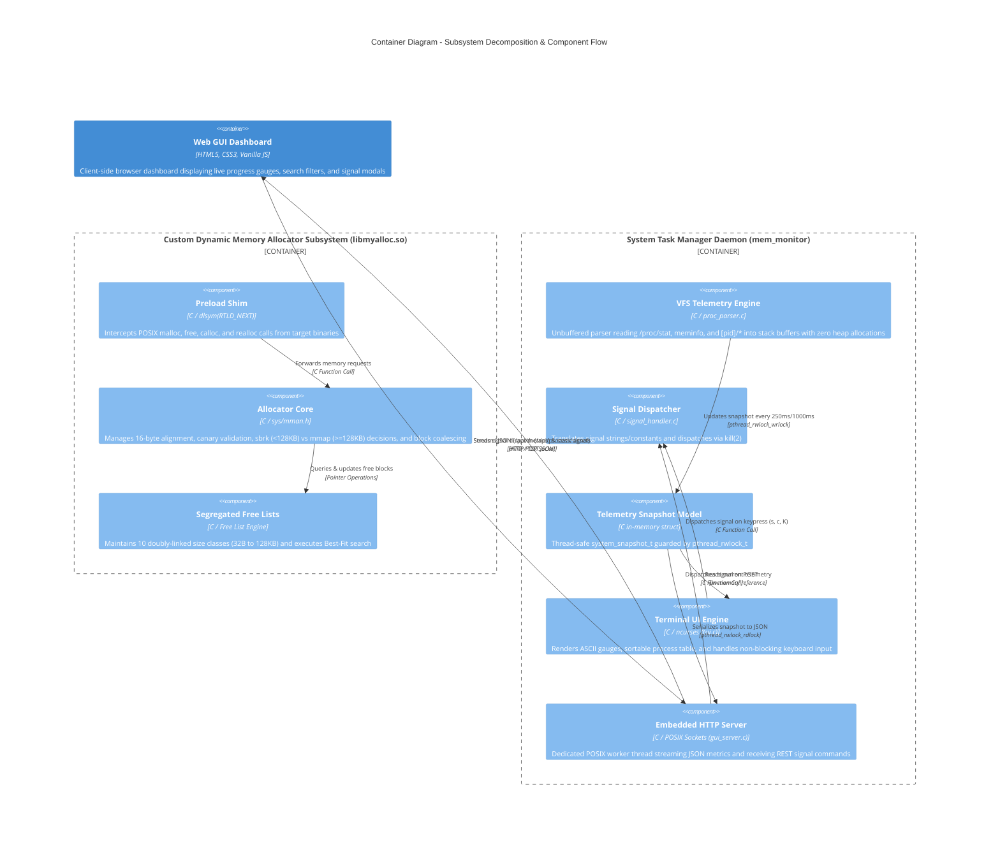

# Container Architecture (C4 Model - Level 2)

This document establishes the **Level 2 Container Decomposition** for the **Linux Dynamic Memory Allocation & System Task Manager** suite. It details the runtime subsystems, component responsibilities, inter-process communication mechanisms, and synchronization boundaries.

---

## 1. Container Overview

The architecture is cleanly separated into two standalone operational deliverables:
1. **`libmyalloc.so` (Dynamic Memory Allocator)**: A compiled C shared library linked at runtime via dynamic symbol resolution (`LD_PRELOAD`).
2. **`mem_monitor` (Task Manager Binary)**: A compiled C executable housing the VFS telemetry engine, the interactive `ncurses` TUI, and an asynchronous HTTP server.

---

## 2. Container Diagram (Mermaid C4)

---

## 3. Subsystem Breakdown & Component Specifications

### 3.1 Allocator Subsystem (`libmyalloc.so`)

| Component | Source Files | Responsibilities | Concurrency & Safety |
|---|---|---|---|
| **Preload Shim** | [`src/allocator/preload_shim.c`](../../src/allocator/preload_shim.c) | Overrides libc `malloc`, `free`, `calloc`, `realloc`. Uses `dlsym(RTLD_NEXT)` for bootstrapping fallback. | Thread-safe, transparent symbol substitution. |
| **Allocator Core** | [`src/allocator/allocator.c`](../../src/allocator/allocator.c) | Enforces 16-byte alignment (`ALIGN`), stamps canary tags (`0xDEADBEEF`/`0xBEEFDEAD`), branches on 128 KB threshold (`sbrk` vs `mmap`), and executes bidirectional coalescing. | Serialized via global heap mutex (`pthread_mutex_t`). |
| **Segregated Free Lists** | [`src/allocator/free_list.c`](../../src/allocator/free_list.c) | Organizes free blocks into 10 discrete bins (32B, 64B, 128B, ..., 128KB). Implements Best-Fit search with higher-bin escalation. | Protected under allocator mutex lock. |

### 3.2 Task Manager Daemon (`mem_monitor`)

| Component | Source Files | Responsibilities | Concurrency & Safety |
|---|---|---|---|
| **VFS Telemetry Engine** | [`src/monitor/proc_parser.c`](../../src/monitor/proc_parser.c) | Directly opens and parses Linux `/proc` VFS nodes using unbuffered `read(2)` into fixed stack buffers. Computes differential multi-core CPU utilization. | Pure functional reads with static snapshot output. Zero heap allocations. |
| **Snapshot Store** | [`include/proc_parser.h`](../../include/proc_parser.h) | Central in-memory `system_snapshot_t` storing global CPU/RAM/Swap metrics and an array of up to 2048 process records. | Synchronized using POSIX Read-Write lock (`pthread_rwlock_t`). |
| **Terminal UI Engine** | [`src/ui/tui.c`](../../src/ui/tui.c) | Manages `ncurses` display lifecycle, non-blocking user input loop, columnar process sorting (by CPU, RAM, PID, Name), and direct keyboard signal dispatch. | Runs on primary application thread. |
| **Embedded HTTP Daemon** | [`src/monitor/gui_server.c`](../../src/monitor/gui_server.c) | Manages TCP server socket on port 8080 (or `--port`), parses GET/POST requests, serves static frontend assets, and serializes JSON metrics. | Executes in an asynchronous detached POSIX thread (`pthread_create`). |
| **Signal Dispatcher** | [`src/monitor/signal_handler.c`](../../src/monitor/signal_handler.c) | Translates POSIX signal names and numeric codes, issues `kill(pid, sig)`, and validates process permissions. | Atomic invocation of kernel `kill(2)` syscall. |

### 3.3 Web GUI Client Subsystem (`web/`)

| Asset | File Path | Role | Technology |
|---|---|---|---|
| **Dashboard View** | [`web/index.html`](../../web/index.html) | Semantic markup for resource meters, process grid, and signal confirmation modal. | HTML5 |
| **Visual Styles** | [`web/style.css`](../../web/style.css) | Dark-mode theme, progress bars, responsive typography, and responsive grid layouts. | Modern CSS3 |
| **Telemetry Client** | [`web/app.js`](../../web/app.js) | Periodic polling client (every 1000ms), dynamic table rendering, search/sort filters, and asynchronous fetch POST dispatch. | Vanilla ES6 JavaScript |

---

## 4. Inter-Process & Thread Synchronization

1. **Allocator Mutex (`alloc_mutex`)**:
   - Ensures atomicity during free list insertion, removal, and `sbrk(2)` heap break modification across multi-threaded client applications.
2. **Snapshot Read-Write Lock (`snapshot_lock`)**:
   - Multiple HTTP client requests reading `/api/metrics` acquire shared read locks (`pthread_rwlock_rdlock`).
   - The monitoring loop acquires an exclusive write lock (`pthread_rwlock_wrlock`) during the microsecond update window.
