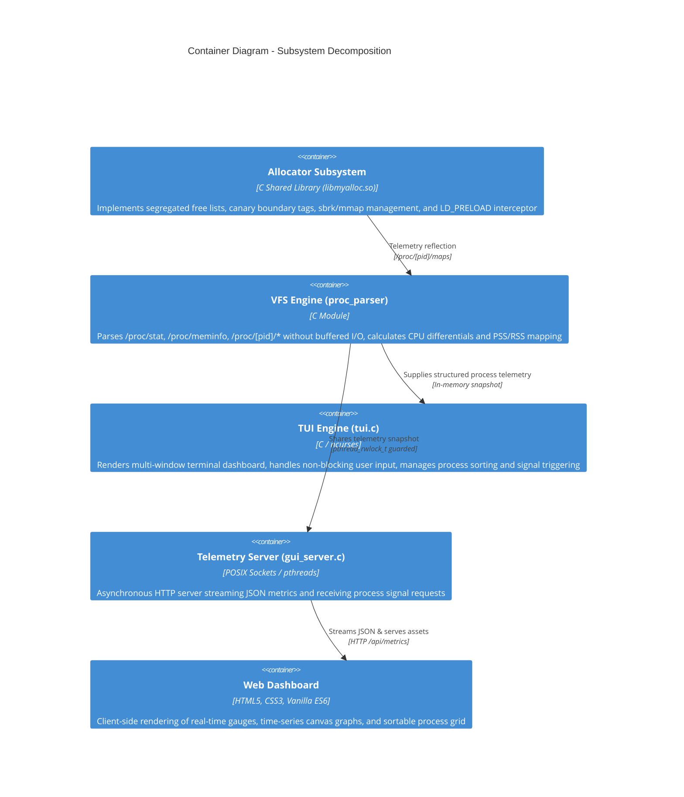

# Container Architecture

The system is decomposed into four modular subsystems executing within the user-space runtime environment.

## Mermaid Container Diagram

```mermaid
C4Container
    title Container Diagram - Subsystem Decomposition

    Container(allocator_mod, "Allocator Subsystem", "C Shared Library (libmyalloc.so)", "Implements segregated free lists, canary boundary tags, sbrk/mmap management, and LD_PRELOAD interceptor")
    
    Container(vfs_parser, "VFS Engine (proc_parser)", "C Module", "Parses /proc/stat, /proc/meminfo, /proc/[pid]/* without buffered I/O, calculates CPU differentials and PSS/RSS mapping")
    
    Container(tui_engine, "TUI Engine (tui.c)", "C / ncurses", "Renders multi-window terminal dashboard, handles non-blocking user input, manages process sorting and signal triggering")
    
    Container(http_server, "Telemetry Server (gui_server.c)", "POSIX Sockets / pthreads", "Asynchronous HTTP server streaming JSON metrics and receiving process signal requests")
    
    Container(web_ui, "Web Dashboard", "HTML5, CSS3, Vanilla ES6", "Client-side rendering of real-time gauges, time-series canvas graphs, and sortable process grid")

    Rel(allocator_mod, vfs_parser, "Telemetry reflection", "/proc/[pid]/maps")
    Rel(vfs_parser, tui_engine, "Supplies structured process telemetry", "In-memory snapshot")
    Rel(vfs_parser, http_server, "Shares telemetry snapshot", "pthread_rwlock_t guarded")
    Rel(http_server, web_ui, "Streams JSON & serves assets", "HTTP /api/metrics")
```
