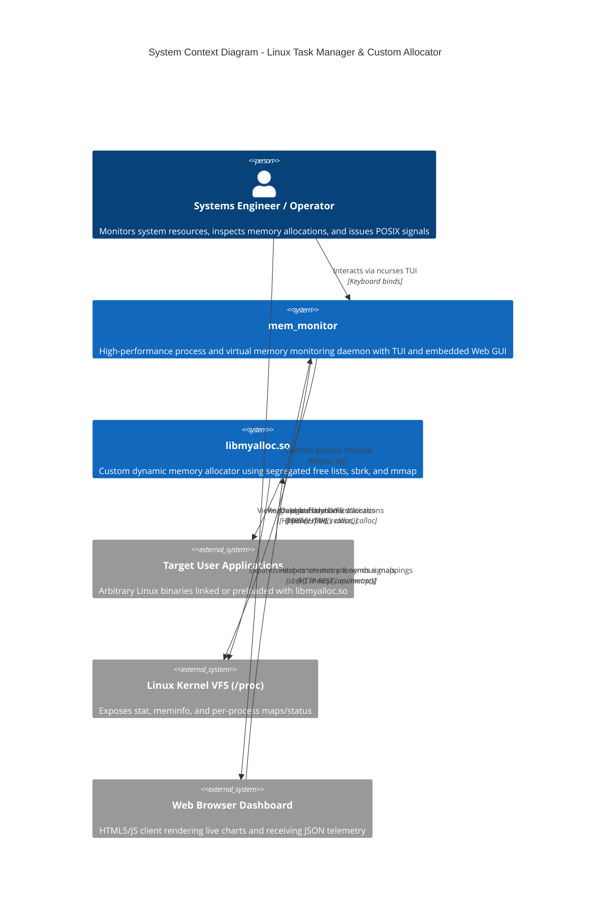

# System Context Architecture

The Linux Dynamic Memory Allocation & System Task Manager operates as a unified systems utility on Linux platforms (Ubuntu 24.04 LTS), interacting with kernel interfaces, user applications, and monitoring clients.

## Mermaid System Context Diagram

