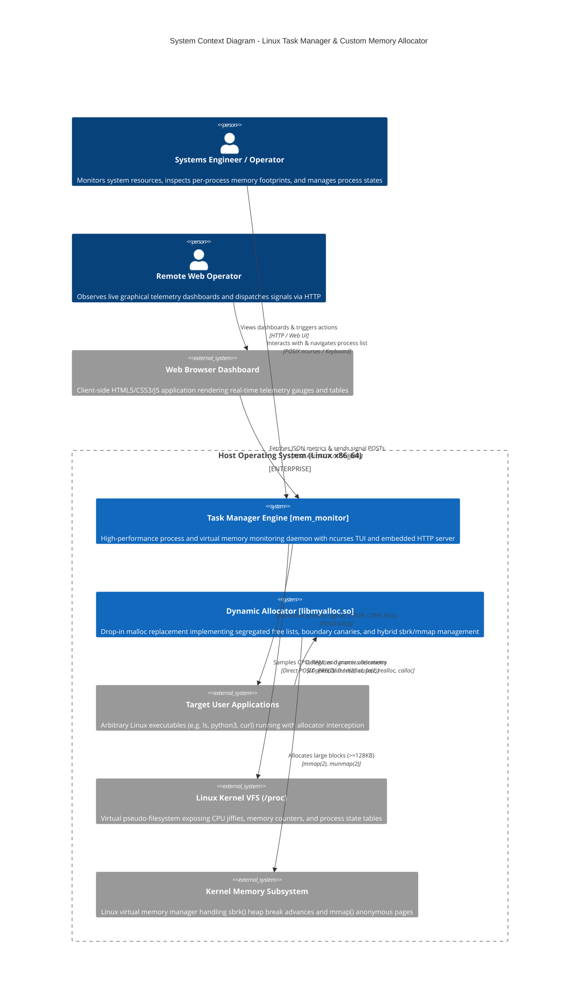

# System Context Architecture (C4 Model - Level 1)

This document establishes the **Level 1 System Context** for the **Linux Dynamic Memory Allocation & System Task Manager** suite. It defines the primary system boundaries, human actors, external operating system interfaces, and data interactions within a Linux runtime environment.

---

## 1. System Overview

The system unifies two high-performance systems engineering capabilities into a single deployment:
1. **`libmyalloc.so`**: A custom dynamic memory allocator shared library capable of intercepting standard C memory operations via dynamic runtime linkage (`LD_PRELOAD`).
2. **`mem_monitor`**: A standalone monitoring daemon that directly samples the Linux kernel Virtual File System (`/proc`) without heap overhead, rendering an interactive Terminal User Interface (TUI) and hosting an embedded HTTP telemetry server for a real-time Web GUI.

---

## 2. System Context Diagram (Mermaid C4)

---

## 3. Actors & External System Interfaces

### 3.1 Actors
- **Systems Engineer / CLI Operator**:
  - Interacts directly with the terminal session running `mem_monitor`.
  - Uses arrow keys or Vim bindings (<kbd>j</kbd>/<kbd>k</kbd>) for navigation, <kbd>p</kbd>/<kbd>m</kbd> for sorting, and <kbd>s</kbd>/<kbd>c</kbd>/<kbd>K</kbd> for signal dispatching.
- **Remote Web Operator**:
  - Accesses the embedded Web GUI via any modern web browser (`http://<host>:<port>`).
  - Observes live canvas utilization graphs and filters processes by PID or name.

### 3.2 External Systems & Kernel Interfaces
- **Linux Virtual File System (`/proc`)**:
  - Mounted pseudo-filesystem created dynamically by the Linux kernel.
  - Serves as the authoritative source of real-time telemetry: system CPU jiffies (`/proc/stat`), global RAM counters (`/proc/meminfo`), and process tables (`/proc/[pid]/stat`, `/proc/[pid]/status`, `/proc/[pid]/smaps_rollup`, `/proc/[pid]/maps`).
- **Linux Virtual Memory Subsystem**:
  - The kernel memory manager responding to program break manipulation (`sbrk`) for contiguous heap expansion.
  - Handles anonymous page allocation (`mmap` with `MAP_PRIVATE | MAP_ANONYMOUS`) and deallocation (`munmap`).
- **Target User Applications**:
  - Any standard dynamically linked Linux binary (e.g., standard coreutils, interpreters, web servers) executing with `LD_PRELOAD=./libmyalloc.so`.

---

## 4. Boundaries & Security Perimeters

1. **Kernel vs. User Space Boundary**:
   - `libmyalloc.so` and `mem_monitor` run entirely in user space.
   - All kernel interactions occur strictly through verified POSIX system calls with defensive errno checking.
2. **Process Privilege Perimeter**:
   - `mem_monitor` only inspects processes visible to the calling user's UID. When executed as `root` (or with `CAP_SYS_PTRACE`), it monitors all host processes.
   - Signal delivery via `kill(2)` is checked by the Linux kernel security model; non-root users cannot kill processes owned by other users.
3. **Network Boundary**:
   - The embedded HTTP server binds by default to `0.0.0.0:8080`.
   - Access can be restricted using standard host firewalls (`iptables`/`ufw`) or bound to loopback for local-only monitoring.
