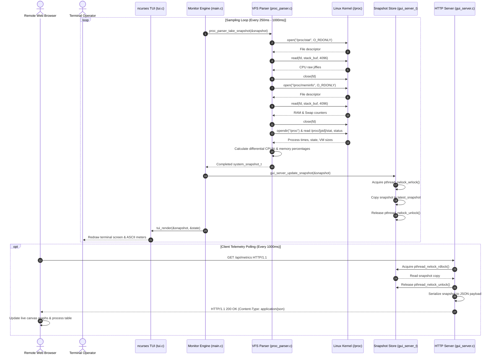
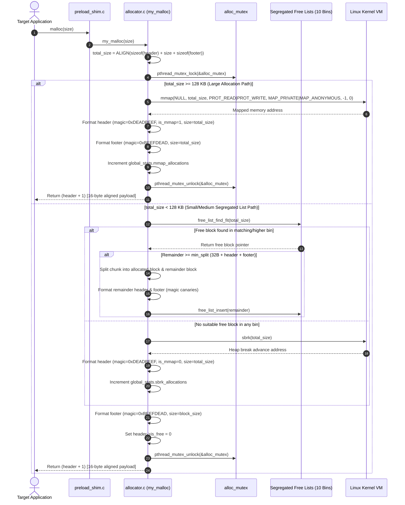
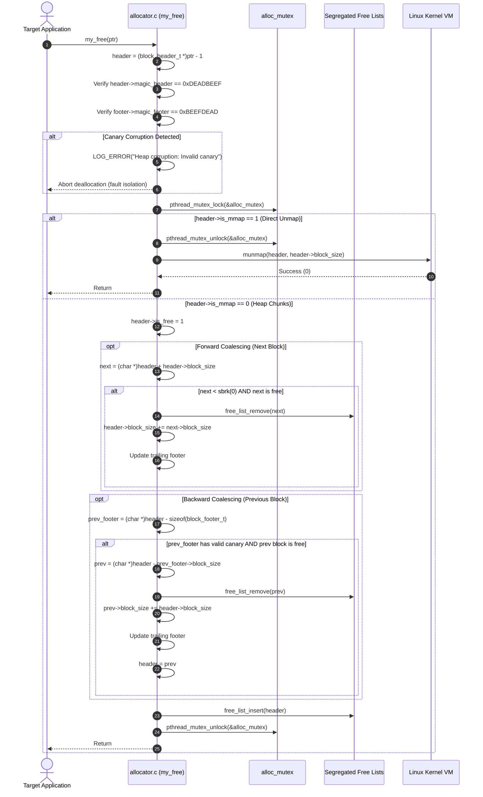
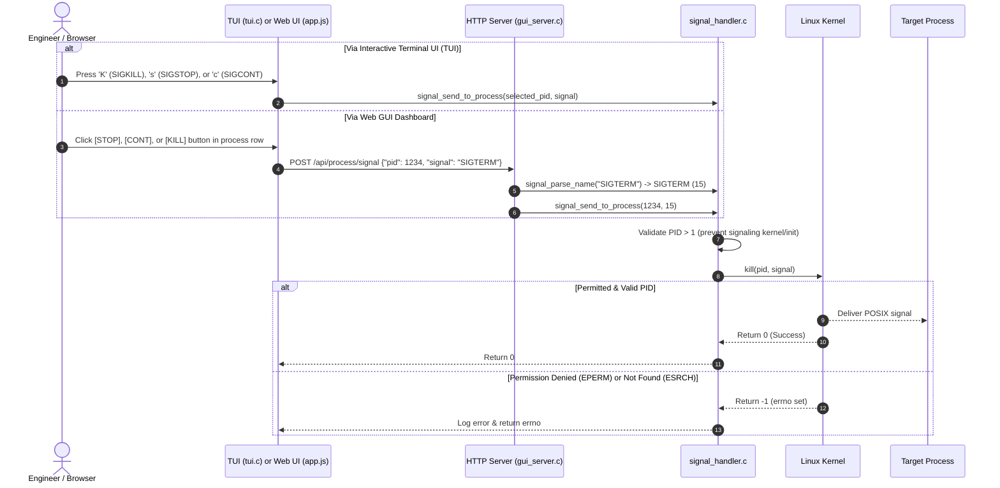

# Telemetry and Allocation Data-Flow Architecture

This document provides exhaustive sequence diagrams and event traces illustrating the runtime data paths across the **Linux Dynamic Memory Allocation & System Task Manager** system.

---

## 1. Metrics Aggregation & Web Streaming Flow

This sequence traces how system metrics flow from the kernel Virtual File System (`/proc`) through the zero-allocation parser into the snapshot store, and subsequently out to both the `ncurses` TUI and the Web GUI client:

---

## 2. Dynamic Memory Allocation Flow (`my_malloc`)

This sequence illustrates the hybrid allocation path inside `libmyalloc.so`, detailing bin searching, block splitting, program break expansion, and anonymous memory mapping:

---

## 3. Memory Deallocation & Bidirectional Coalescing (`my_free`)

This sequence traces boundary canary validation, adjacent block inspection, and bidirectional merging:

---

## 4. Process Signal Dispatch Flow

This sequence demonstrates both local keyboard signal delivery and remote HTTP REST signal dispatch:

