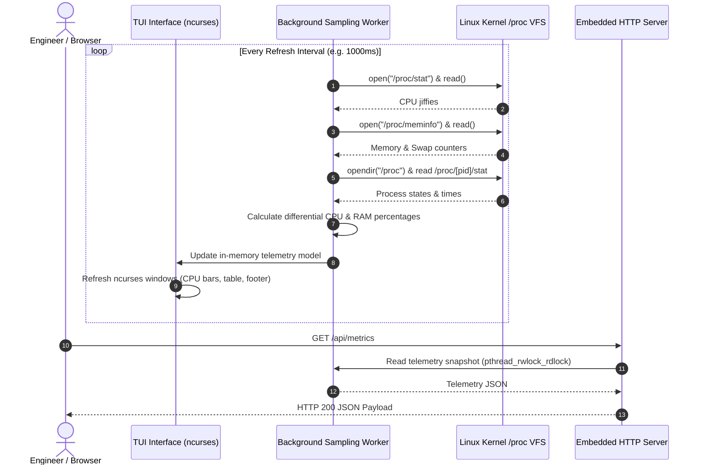
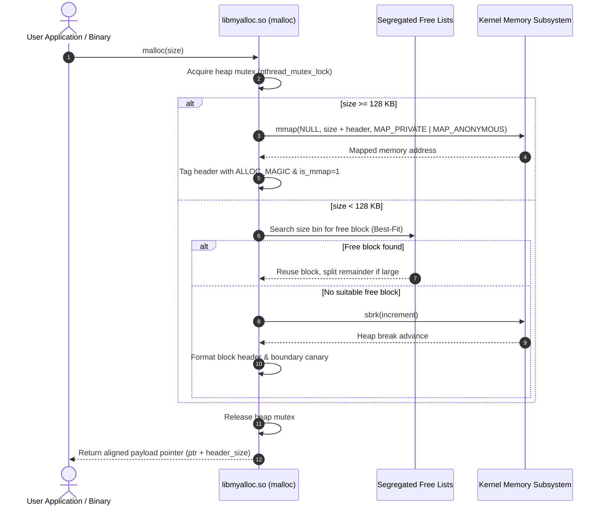

# Telemetry and Allocation Data-Flow

## 1. Metrics Aggregation & Web Streaming Flow

```mermaid
sequenceDiagram
    autonumber
    actor User as Engineer / Browser
    participant TUI as TUI Interface (ncurses)
    participant Worker as Background Sampling Worker
    participant VFS as Linux Kernel /proc VFS
    participant Server as Embedded HTTP Server
    
    loop Every Refresh Interval (e.g. 1000ms)
        Worker->>VFS: open("/proc/stat") & read()
        VFS-->>Worker: CPU jiffies
        Worker->>VFS: open("/proc/meminfo") & read()
        VFS-->>Worker: Memory & Swap counters
        Worker->>VFS: opendir("/proc") & read /proc/[pid]/stat
        VFS-->>Worker: Process states & times
        Worker->>Worker: Calculate differential CPU & RAM percentages
        Worker->>TUI: Update in-memory telemetry model
        TUI->>TUI: Refresh ncurses windows (CPU bars, table, footer)
    end

    User->>Server: GET /api/metrics
    Server->>Worker: Read telemetry snapshot (pthread_rwlock_rdlock)
    Worker-->>Server: Telemetry JSON
    Server-->>User: HTTP 200 JSON Payload
```

## 2. Dynamic Memory Allocation Flow (`libmyalloc.so`)

```mermaid
sequenceDiagram
    autonumber
    actor App as User Application / Binary
    participant Alloc as libmyalloc.so (malloc)
    participant SegList as Segregated Free Lists
    participant OS as Kernel Memory Subsystem
    
    App->>Alloc: malloc(size)
    Alloc->>Alloc: Acquire heap mutex (pthread_mutex_lock)
    alt size >= 128 KB
        Alloc->>OS: mmap(NULL, size + header, MAP_PRIVATE | MAP_ANONYMOUS)
        OS-->>Alloc: Mapped memory address
        Alloc->>Alloc: Tag header with ALLOC_MAGIC & is_mmap=1
    else size < 128 KB
        Alloc->>SegList: Search size bin for free block (Best-Fit)
        alt Free block found
            SegList-->>Alloc: Reuse block, split remainder if large
        else No suitable free block
            Alloc->>OS: sbrk(increment)
            OS-->>Alloc: Heap break advance
            Alloc->>Alloc: Format block header & boundary canary
        end
    end
    Alloc->>Alloc: Release heap mutex
    Alloc-->>App: Return aligned payload pointer (ptr + header_size)
```
